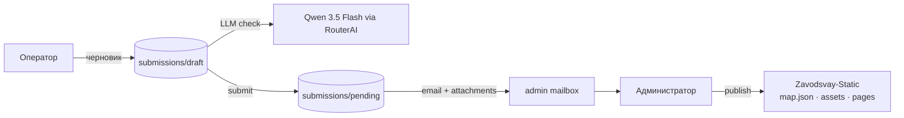

# CONTEXT.md — Контекст разработки MapControl

> Живой документ для разработчика и AI-ассистента.  
> Фиксирует решения, принятые компромиссы, текущее состояние MVP и следующий технический шаг.  
> Обновлять после каждой значимой сессии.

**Репозиторий:** https://github.com/AlexanderKuzikov/MapControl  
**Локальный путь:** `D:\GitHub\MapControl`  
**Связанный проект (сайт):** [Zavodsvay-Static](https://github.com/AlexanderKuzikov/Zavodsvay-Static) — `D:\GitHub\Zavodsvay-Static`

---

## Назначение проекта

**MapControl** — локальный инструмент для **безопасного добавления новых объектов** на карту выполненных работ сайта [zavodsvay.ru](https://zavodsvay.ru/).

Краткая формулировка:

> Оператор собирает данные и фото объекта, LLM приводит текст к деловому и единообразному виду, определяет категорию объекта и считает количество свай из описания. Заявка сохраняется локально, дублируется на email администратора, после чего администратор модерирует заявку, кадрирует изображения и публикует объект в пайплайн сайта.

**MapControl не является SSOT.** После публикации источником правды остаётся `data/map.json` в `Zavodsvay-Static`.

---

## Текущее состояние

На конец сессии реализован **рабочий MVP операторского контура**:

- создание черновика заявки
- редактирование заголовка, описания и координат
- выбор точки на **Яндекс.Картах v3** или ручной ввод
- загрузка фото и конвертация в **WebP** через `sharp`
- проверка текста через LLM
- **LLM определяет категорию объекта** (`category_suggested`) из 9 значений
- **LLM считает количество свай** (`pileCount_suggested`) если число явно указано в тексте
- применение предложенного текста или сохранение исходного варианта оператора
- оператор может скорректировать `category` и `pileCount` вручную после LLM-заполнения
- отправка заявки в `data/submissions/pending/`
- **SMTP-отправка заявки на email администратора** вместе с JSON и изображениями
- базовая защита backend: `sanitizeId`, защита от path traversal, валидация входов
- исправление зависания UI при ошибке LLM
- частичная правка diff-UI: кнопки действий вынесены под соответствующие колонки

---

## Ключевое решение по LLM

### Что проверяли

Тестировалась связка **Qwen 3.5 Flash** через OpenAI-compatible провайдеров.

Изначально использовался `vsellm.ru` с моделью:

```text
qwen/qwen3.5-flash
```

Проблема оказалась не в качестве модели, а в том, что провайдер по умолчанию запускал reasoning/thinking, из-за чего:

- output раздувался до ~2.3K токенов
- запрос шёл до 1.5–2 минут
- UI сценарий оператора становился непригодным

### Что не сработало

Эти способы у `vsellm` не решили задачу полностью:

- `thinking: { type: 'disabled' }`
- `/no_think` в prompt

### Что сработало технически

Для Qwen на vLLM-совместимом провайдере сработал параметр:

```json
{
  "chat_template_kwargs": {
    "enable_thinking": false
  }
}
```

После этого на `vsellm` usage стало нормальным — примерно **332 → 96** токенов, то есть thinking действительно отключался.

### Почему `vsellm` всё равно не подошёл

Несмотря на технически правильное отключение thinking, latency остался слишком большим — около **90 секунд**. Для операторского интерфейса это неприемлемо.

### Текущее рабочее решение

Выбран провайдер **RouterAI**:

```env
LLM_BASE_URL=https://routerai.ru/api/v1
LLM_MODEL=qwen/qwen3.5-flash-02-23
```

Практический результат на тесте:

- input/output порядка `331 / 138`
- latency около **1.9 сек**
- цена запроса около **0.0053 ₽**
- ответ подробный, полезный и структурированный
- warnings и `confidence: low` формируются корректно
- `category_suggested` и `pileCount_suggested` работают корректно

### Вывод

На текущем этапе решение такое:

- **модель оставляем Qwen 3.5 Flash**
- **провайдер фиксируем RouterAI**
- `vsellm` оставляем как экспериментальный fallback, но не как рабочий runtime для операторов

---

## Ключевое решение по Email

### Что решили

Для доставки новых заявок выбран **SMTP через biz.mail.ru / smtp.mail.ru** с корпоративного адреса:

```text
mapcontrol@exlibrum.ru
```

Причина выбора простая: пользователь **не хочет связываться с Яндексом**, а локальному MVP нужен максимально прямой и надёжный транспорт без внешних интеграционных слоёв.

### Что подтвердили на практике

1. TCP-соединение с `smtp.mail.ru:465` устанавливается успешно.
2. Отправка через PowerShell прошла.
3. Для biz.mail.ru основной пароль **не подходит** — сервер требует **пароль приложения**.
4. После включения 2FA и генерации app password почта отправляется корректно.
5. Получение на `alexander@kuzikov.com` подтверждено.

### Почему решение хорошее

Это оказалось **очень удачной архитектурной находкой** для MVP:

- заявка сохраняется локально в `pending`
- тот же payload дублируется по email
- письмо уже является транспортом данных для будущей админки
- в теле можно положить читаемый summary + сырой JSON
- фото идут как вложения
- не нужен отдельный queue-брокер, webhook, IMAP-парсер или внешний SaaS

По сути email здесь — это **простая и надёжная transport layer** между операторским контуром и будущим админским приложением.

### Что уже реализовано в коде

В `src/server.js` добавлено:

- чтение SMTP-параметров из `.env`
- lazy-init транспорта через `nodemailer`
- функция `sendSubmissionEmail(meta, imagesDir)`
- HTML + text письмо с категорией и количеством свай
- вложение всех `.webp` из `pending/images`
- вызов email-отправки внутри `/api/submissions/draft/:id/submit`

### Ограничение текущей реализации

Сейчас email-отправка выполняется **синхронно в submit-request**. Это означает:

- данные уже сохранены в `pending`
- но если SMTP вернёт ошибку, API-ответ уйдёт как 500
- то есть persisted state и side effect пока сцеплены слишком жёстко

Это приемлемо для первого рабочего шага, но **не финальная архитектура**.

### Следующий шаг по email

Нужно перейти к одной из схем:

1. **outbox pattern** — сохранять статус письма рядом с заявкой и отправлять отдельно
2. **fire-and-forget** после успешного submit
3. в будущем — два адреса:
   - `MAIL_TO` — ящик/канал для машинной обработки админкой
   - `MAIL_NOTIFY` — личное уведомление Александру

---

## Текущий LLM-контракт

### Prompt

Промпт вынесен в отдельный файл:

```text
src/prompts/check-text.txt
```

Это нужно, чтобы:

- править prompt без редактирования backend-логики
- версионировать изменения отдельно
- позже привязать `prompt_version` к реальному содержимому

### Payload

Текущие рабочие параметры LLM-запроса:

```json
{
  "model": "qwen/qwen3.5-flash-02-23",
  "temperature": 0.1,
  "max_tokens": 512,
  "chat_template_kwargs": {
    "enable_thinking": false
  },
  "response_format": {
    "type": "json_object"
  }
}
```

### Ожидаемый JSON-ответ

```json
{
  "title_suggested": "...",
  "techDescription_suggested": "...",
  "warnings": ["..."],
  "confidence": "high",
  "category_suggested": "house",
  "pileCount_suggested": 8
}
```

Актуальные правила:

- `category_suggested` — обязательное поле, модель выбирает всегда; по умолчанию (fallback на сервере) `other`
- `pileCount_suggested` — только если количество свай **явно** присутствует в тексте (целое число > 0)
- если данных недостаточно, модель не додумывает, а пишет предупреждения в `warnings[]`
- `confidence` — практическая оценка полноты и качества входного текста

### Категории объектов

| Ключ | Описание |
|------|----------|
| `house` | Жилой дом, коттедж, дача |
| `banya` | Баня, хозяйственные постройки |
| `fence` | Забор, ограждение |
| `commercial` | Магазин, офис, кафе, склад |
| `industrial` | Цех, производство, завод |
| `water` | Понтон, пирс, плавец |
| `social` | Школа, остановка, спорт, арт-объект |
| `agro` | Ферма, теплица, гараж, постройки на земле |
| `other` | Прочее |

### Почему Zod-schema на сервере

`CATEGORY_VALUES` вынесен как константа в `server.js` и используется в двух местах:

- `LlmOutSchema` — валидация ответа модели, `.default('other')` как fallback
- `apply-llm` schema — валидация operator-final значения при сохранении

Это единственный источник правды для допустимых категорий на backend.

### Наблюдение по качеству

RouterAI на текущей модели даёт **чуть более дли��ный**, но полезный ответ: не просто минимальную правку, а ещё вменяемые warnings и замечания по качеству исходника. Это приемлемо и даже полезно для операторского сценария.

---

## Архитектура потока



### Роли

| Роль | Может | Не может |
|------|-------|----------|
| **Оператор** | Ввести текст, координаты, фото; проверить текст через LLM; скорректировать категорию и pileCount; отправить заявку | Публиковать на сайт, назначать `id` |
| **Администратор** | Просмотреть заявку, кадрировать, публиковать | — |

---

## Принятые backend-решения

### Развёртывание

- локальное приложение: **Node.js + Express + browser UI**
- без публичного сервера на старте
- хранение заявок отдельно от сайта

### Данные заявок

```text
data/submissions/
  draft/{submission_id}/
    meta.json
    images/
    images_cropped/
  pending/{submission_id}/
    meta.json
    images/
    images_cropped/
  archive/
```

### Структура `meta.json`

```json
{
  "submission_id": "...",
  "status": "draft",
  "created_at": "...",
  "updated_at": "...",
  "coords": [lat, lng],
  "title_original": "...",
  "techDescription_original": "...",
  "title_operator_final": "...",
  "techDescription_operator_final": "...",
  "category": "house",
  "pileCount": 8,
  "llm": {
    "provider": "openai-compatible",
    "model": "qwen/qwen3.5-flash-02-23",
    "prompt_version": "v1",
    "checked_at": "...",
    "latency_ms": 1923,
    "confidence": "high",
    "category_suggested": "house",
    "pileCount_suggested": 8,
    "warnings": []
  },
  "images": []
}
```

### Что уже внедрено в сервере

- `sanitizeId()` для всех маршрутов с `:id`
- `assertInsideSubmissions()` с `path.resolve()`
- Zod-валидация входных данных
- whitelist форматов изображений
- `response_format: json_object`
- fallback-очистка `<think>...</think>` в ответе модели
- prompt загружается из файла при старте сервера
- чтение SMTP-конфига из `.env`
- `sendSubmissionEmail()` через `nodemailer`
- прикрепление изображений из `pending/images`
- subject/body письма строятся из `meta.json`, включая `category` и `pileCount`
- `CATEGORY_VALUES` как единый enum на сервере
- `category_suggested` с `.default('other')` в `LlmOutSchema`
- `category` и `pileCount` сохраняются в `meta.json` через `apply-llm`

### Что изменили по таймауту

Сначала был добавлен `AbortController` и timeout для LLM-запросов. Затем timeout **убран полностью** по решению пользователя, чтобы можно было дождаться фактического ответа и измерить реальную latency провайдера.

Итог: сейчас backend **не обрывает** LLM-запрос по таймеру.

---

## Принятые frontend-решения

### Что работает

- валидация обязательных полей перед LLM-check
- загрузка фото до запуска LLM
- показ исходного и предложенного текста
- показ `warnings[]`
- выбор: принять правки LLM или оставить свой текст
- после LLM-ответа автозаполнение `category` (select) и `pileCount` (input)
- оператор может изменить оба поля вручную
- `llmMeta` строка показывает `confidence · category · piles · latency`
- submit становится доступным только после применения одного из вариантов

### Исправленный баг

Был дефект: при ошибке LLM UI зависал в состоянии **«Проверяем…»**, кнопки оставались disabled.

Исправление:

- `checkLLM()` обёрнут в `try/catch`
- введён `resetLlmUI()`
- `btnCheck` корректно разблокируется после ошибки

### Корневая причина отсутствия category в UI (исправлено 2026-05-28)

`category_suggested` не объявлялся в `LlmOutSchema` на сервере — Zod молча выкидывал поле при `.parse()`. До клиента оно не доходило. Исправлено добавлением поля в схему с `.default('other')`.

### Что осталось шероховатым

Текущее выравнивание diff-блока уже лучше, но пользователь отдельно отметил, что это **ещё не идеально соответствует исходному замыслу**. Значит, diff-layout пока считать **рабочим, но не финально отполированным**.

---

## Связь с Zavodsvay-Static

### SSOT сайта

В основном проекте единственный реестр объектов:

- `data/map.json`
- изображения в `assets/img/objects/{id}/`
- страницы `pages/objects/{id}/index.php`
- `url` появляется только после публикации

### Что должен сделать MapControl на этапе publish

1. создать новый `id`
2. записать объект в `data/map.json`
3. экспортировать изображения в структуру сайта
4. создать страницу объекта
5. обновить `sitemap.xml`
6. явно показать, что деплой сайта — отдельный шаг

### Базовый принцип

**GUI MapControl и CLI сайта не должны расходиться в бизнес-логике публикации.** Лучше переиспользовать те же правила, чем дублировать логику вручную.

---

## Обязательные поля оператора

На текущем этапе согласовано:

- `title` — обязательно
- `techDescription` — обязательно
- `coords` — обязательно
- минимум **1 изображение** — обязательно
- без успешного прохождения сценария LLM-check заявка дальше не уходит

---

## Что сделано за последние сессии

| Блок | Сделано |
|------|---------|
| **LLM** | вынесен prompt в `src/prompts/check-text.txt` |
| **LLM** | снижена `temperature` до `0.1` |
| **LLM** | добавлен `max_tokens: 512` |
| **LLM** | протестированы методы отключения thinking |
| **LLM** | найден рабочий параметр `chat_template_kwargs.enable_thinking=false` |
| **LLM** | выбран новый провайдер `RouterAI` из-за latency |
| **LLM** | добавлено поле `category_suggested` в промпт и схему ответа |
| **LLM** | исправлен баг: `category_suggested` не проходил через Zod на сервере |
| **Backend** | добавлены `sanitizeId`, path checks, Zod error handling |
| **Backend** | добавлен whitelist форматов изображений |
| **Backend** | внедрена SMTP-отправка через `nodemailer` |
| **Backend** | заявка теперь уходит на email вместе с JSON и WebP-вложениями |
| **Backend** | `category` и `pileCount` сохраняются в `meta.json` через `apply-llm` |
| **Backend** | `CATEGORY_VALUES` как единый enum, используется в двух местах |
| **Backend** | email-шаблон дополнен категорией и количеством свай |
| **Frontend** | добавлены поля `category` (select) и `pileCount` (input) с бейджем ИИ |
| **Frontend** | автозаполнение полей после LLM-ответа |
| **Frontend** | исправлено зависание после ошибки LLM |
| **Frontend** | частично переразложен diff-блок с кнопками действий |
| **Docs** | обновлён `README.md` под фактический MVP |

---

## Что делать дальше

Приоритет следующего этапа:

1. развязать submit и SMTP: outbox / async email flow
2. добавить второй адрес доставки: `MAIL_TO` + `MAIL_NOTIFY`
3. добавить серверный лог LLM latency и usage, если провайдер возвращает usage
4. описать и реализовать **admin flow**:
   - список pending-заявок
   - просмотр карточки заявки
   - кадрирование
   - publish в `Zavodsvay-Static`
5. нормализовать структуру `meta.json` под будущий админский сценарий
6. подготовить слой publish/import без расхождения с CLI сайта

---

## Открытые вопросы

| # | Вопрос | Статус |
|---|--------|--------|
| 1 | Нужен ли отдельный экран списка черновиков оператора | Открыто |
| 2 | Какой UI-режим для администратора: тот же web UI или отдельный route/layout | Открыто |
| 3 | Как именно организовать publish в сайт: прямой FS-доступ или вызов общего модуля/скрипта | Открыто |
| 4 | Нужен ли повторный LLM-check на стороне админа | Скорее да, но позже |
| 5 | Нужен ли bbox-check координат по Пермскому краю | Открыто |
| 6 | Где хранить provider label / base URL в `meta.llm` для трассировки | Частично внедрено, надо нормализовать |
| 7 | Обязателен ли шаг LLM-check перед submit всегда, без обхода | Сейчас по факту да |
| 8 | Нужен ли отдельный email-status/state в `meta.json` | Да, на следующем этапе |

---

## Риски и страховки

| Риск | Митигация |
|------|-----------|
| Провайдер внезапно деградирует по latency | Логировать latency и usage, держать fallback-провайдера |
| Модель начинает выдумывать цифры | строгий prompt + warnings + ручное принятие результата |
| Модель выдаёт невалидную категорию | Zod `.default('other')` как fallback на сервере |
| UI кажется «зависшим» | явная обработка ошибок и возврат кнопок в активное состояние |
| SMTP временно падает | развязать persisted state и отправку через outbox / async flow |
| Расхождение MapControl и логики публикации сайта | вынос publish-правил в общий слой / переиспользование CLI-логики |
| Потеря provenance по LLM | записывать provider/model/prompt_version/checked_at в `meta.llm` |
| Email-канал разрастётся в ad-hoc интеграцию | заранее зафиксировать контракт письма: summary + raw JSON + attachments |

---

## Режим работы с AI

- Перед сессией читать `README.md` и `CONTEXT.md`
- Не опираться на старое описание проекта, если код уже ушёл дальше документации
- Коммиты в репозиторий — только по запросу пользователя
- При изменении архитектурного решения обновлять этот файл сразу, а не постфактум

---

## Журнал изменений

| Дата | Событие |
|------|---------|
| 2026-05-26 | Создан репозиторий MapControl, initial README |
| 2026-05-26 | Зафиксирована двухэтапная схема: оператор → админ → publish в Zavodsvay-Static |
| 2026-05-26 | Создан `CONTEXT.md` |
| 2026-05-28 | Реализован рабочий MVP операторского контура: форма, карта, WebP, draft/pending |
| 2026-05-28 | Вынесен prompt в `src/prompts/check-text.txt` |
| 2026-05-28 | Исследовано отключение thinking у Qwen; найден рабочий параметр `chat_template_kwargs.enable_thinking=false` |
| 2026-05-28 | Подтверждено, что `vsellm` технически работает, но не подходит по latency (~90 сек) |
| 2026-05-28 | Выбран RouterAI + `qwen/qwen3.5-flash-02-23` как текущий рабочий провайдер |
| 2026-05-28 | Убран LLM-timeout, чтобы видеть реальную скорость ответа провайдера |
| 2026-05-28 | Исправлено зависание UI после ошибки LLM |
| 2026-05-28 | Подтверждена рабочая SMTP-отправка через biz.mail.ru с app password |
| 2026-05-28 | В `submit` добавлена отправка email с JSON и WebP-вложениями через `nodemailer` |
| 2026-05-28 | Частично переразложен diff-UI: кнопки действий вынесены под соответствующие колонки |
| 2026-05-28 | Добавлены поля `category` и `pileCount` — заполняются LLM, редактируются оператором |
| 2026-05-28 | Исправлен баг: `category_suggested` вырезался Zod на сервере до клиента не доходил |
| 2026-05-28 | `CATEGORY_VALUES` вынесен как константа, используется в `LlmOutSchema` и `apply-llm` |
| 2026-05-28 | Email-шаблон дополнен категорией и количеством свай |
| 2026-05-28 | Обновлён `README.md` и `CONTEXT.md` под фактически реализованное состояние |

---

## Ссылки

- Сайт: https://zavodsvay.ru/map/
- GitHub MapControl: https://github.com/AlexanderKuzikov/MapControl
- GitHub Zavodsvay-Static: https://github.com/AlexanderKuzikov/Zavodsvay-Static
- Данные сайта: `Zavodsvay-Static/data/map.json`
