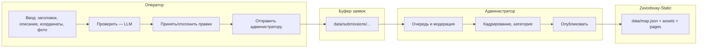
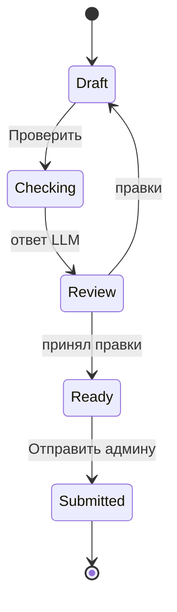

# CONTEXT.md — Контекст разработки MapControl

> Живой документ для разработчика и AI-ассистента.  
> Фиксирует обсуждения, решения, планы и этапы работы. Дополняет README.md.  
> Обновлять после каждой значимой сессии.

**Репозиторий:** https://github.com/AlexanderKuzikov/MapControl  
**Локальный путь:** `D:\GitHub\MapControl`  
**Связанный проект (сайт):** [Zavodsvay-Static](https://github.com/AlexanderKuzikov/Zavodsvay-Static) — `D:\GitHub\Zavodsvay-Static`

---

## Назначение проекта

**MapControl** — локальная утилита для **безопасного добавления новых объектов** на карту выполненных работ сайта [zavodsvay.ru](https://zavodsvay.ru/).

Краткое описание (для README / GitHub About):

> Конструктор заявок на объекты карты: оператор собирает данные и изображения, LLM выравнивает стиль и орфографию, администратор модерирует, кадрирует медиа и публикует объект в единый пайплайн сайта.

**MapControl не заменяет** сайт и **не является** вторым SSOT объектов. После публикации источник правды по-прежнему `data/map.json` в Zavodsvay-Static.

---

## Проблема, которую решаем

| Было | Станет |
|------|--------|
| CLI `tools/add-object.mjs` — только для подготовленных | Пошаговый UI для операторов |
| Риск ошибок в координатах, категории, именах файлов | Валидация + карта + фиксированные enum |
| Прямое редактирование `map.json` | Буфер заявок → модерация → публикация админом |
| Массовая подготовка 529+ объектов через LLM (разово) | LLM в потоке каждой новой заявки |

---

## Связь с Zavodsvay-Static

### SSOT на сайте

В основном проекте единственный реестр объектов:

- **`data/map.json`** — массив ~530 объектов, поля: `id`, `coords`, `category`, `pileCount`, `title`, `techDescription`, `images`, `url`
- **`data/objects.json`** — не существует и не планируется
- Координаты: **`[latitude, longitude]`** — для ymaps3 swap не нужен
- Изображения в проде: `assets/img/objects/{id}/{id}_N.webp`
- Страницы: `pages/objects/{id}/index.php` → `_template.php`
- Публикация на карте: непустой `url` → маркер «опубликован»

### Что делает MapControl при «Опубликовать»

Оркестрация (логика уже есть в Zavodsvay-Static, MapControl должен вызывать тот же контракт):

1. Запись объекта в `data/map.json` (новый `id`, категория от админа)
2. Экспорт обработанных фото в `assets/img/objects/{id}/`
3. Создание `pages/objects/{id}/index.php` (как `generate-pages.mjs`)
4. Обновление `sitemap.xml` (как `generate-sitemap.mjs`)
5. Явное напоминание: **сборка/деплой сайта** — отдельный шаг вне MapControl

### Существующие скрипты сайта (референс)

| Скрипт | Назначение |
|--------|------------|
| `tools/add-object.mjs` | CLI: добавить объект в map.json + страница + sitemap |
| `generate-pages.mjs` | Генерация всех `pages/objects/{id}/` |
| `generate-sitemap.mjs` | Sitemap из объектов с `url` |
| `update-map-json.mjs` | Синхронизация `url` и `images` (устаревший путь картинок) |

**Принцип:** бизнес-логика публикации — **одна**; GUI MapControl и CLI не должны расходиться в правилах.

### Категории объектов (enum)

`house`, `banya`, `fence`, `commercial`, `industrial`, `water`, `social`, `agro`, `other`

Назначает **только администратор** на этапе модерации.

### LLM на сайте (исторический прецедент)

При подготовке всех 529+ записей `map.json` использовалась облачная **Qwen 3.5 Flash** — нормализация полей, орфография, категоризация. MapControl продолжает этот подход для потоковых заявок.

---

## Архитектура: два этапа, две роли



| Роль | Может | Не может |
|------|-------|----------|
| **Оператор** | Черновики, загрузка фото, координаты, LLM «Проверить», отправка заявки | Публиковать, править `map.json`, назначать `id` и `category` |
| **Администратор** | Очередь, правка текста, категория, кадрирование, публикация, отклонение с причиной | — (единый оркестратор прода) |

---

## Согласованные технические решения

### Развёртывание

- **Локальное приложение**: Node.js backend + браузер (локальный web UI), без публичного сервера на первом этапе
- Два режима в одном приложении: **Оператор** / **Администратор** (переключение через PIN/пароль — детали позже)
- Заявки хранятся **отдельно** от `map.json` до публикации

### LLM

- **Облако по API (OpenAI-compatible)** (ключ в локальном конфиге, не в git)
- Endpoint (может меняться): `https://api.vsellm.ru/v1`
- Default model (может меняться): `qwen/qwen3.5-flash`
- Прогон на этапе оператора по кнопке **«Проверить»**
- На первом этапе в API уходит **только текст** (заголовок + описание); фото в облако **не** отправляются
- Сильнее модель — опционально позже (низкий confidence, кнопка у админа)
- LLM **не публикует** и **не меняет координаты** без явного действия человека
- Правило промпта: не выдумывать числа, марки свай, адреса; недостающее — в `warnings[]`

### Изображения

| Этап | Действие |
|------|----------|
| Оператор | Приём JPG/PNG/HEIC → **WebP** (sharp), ресайз по ширине **до 2048px**, quality **80%** |
| Админ | Кадрирование; при необходимости дополнительный ресайз/пережатие при экспорте в прод |
| Прод | `assets/img/objects/{id}/{id}_N.webp` |

Лимиты (рекомендация, уточнить при реализации): число файлов, макс. размер до конвертации.

### Координаты

- Ввод: **числа с валидацией** и/или **клик по карте** (Яндекс.Карты v3, как на сайте)
- Карта (ключ хранить только в `.env.local`, не коммитить): `https://api-maps.yandex.ru/v3/`
- Синхронизация: поля lat/lng ↔ маркер
- Мягкая проверка bbox Пермского края (предупреждение, не жёсткий блок — если бывают объекты снаружи)

### Текст заявки (версии)

Для аудита и экрана админа хранить:

| Поле | Смысл |
|------|--------|
| `original` | Как ввёл оператор до первой проверки |
| `llm_suggested` | Сырой ответ модели |
| `operator_final` | Что оператор отправил админу |
| `admin_final` | После правок админа (перед публикацией) |

### Публикация

- Только админ, одна кнопка **«Опубликовать на сайт»**
- `id` — при публикации (рекомендация: `max(id) + 1`, без «заполнения дыр» для простоты)
- `url` = `/objects/{id}/` — только при публикации
- `pileCount` — в данных сайта есть, в UI оператора **нет**; админ может добавить позже

### Обязательность полей (решение)

- На этапе оператора: **все поля обязательны**: `title`, `techDescription`, `coords`, минимум 1 изображение
- На этапе публикации (SSOT): все поля объекта присутствуют; `images` может быть `[]` только в исключительных случаях (обсудить, если понадобится)

---

## Поток оператора (экраны O0–O5)

| ID | Экран | Назначение |
|----|--------|------------|
| **O0** | Список заявок | Черновики / отправленные / отклонённые |
| **O1** | Форма + карта + фото | Заголовок*, описание*, координаты*, фото* |
| **O2** | LLM загрузка | Ожидание API, отмена, ошибка сети |
| **O3** | Diff | Было / предлагает ИИ, принять по полям, замечания, итоговый текст |
| **O4** | Подтверждение отправки | Сводка, «после отправки не редактируется» |
| **O5** | Успех | Номер заявки, возврат к списку |

**Обязательно перед «Проверить»:** заголовок, описание, координаты, ≥1 фото.

**Перед «Отправить администратору»:** хотя бы одна успешная «Проверить» (или явное «отправить без проверки» — **не решено**, по умолчанию требовать проверку).



---

## Поток администратора (экраны A0–A5)

| ID | Экран | Назначение |
|----|--------|------------|
| **A0** | Очередь | Новые / в работе / отклонённые |
| **A1** | Карточка заявки | Текст (исходник → финал оператора), фото, карта, категория*, превью, LLM снова |
| **A2** | Кадрирование (modal) | Рамка, поворот, применить |
| **A3** | Подтверждение публикации | Чеклист действий в Zavodsvay-Static |
| **A4** | Отклонение | Причина (обязательно), шаблоны |
| **A5** | Успех публикации | id, ссылка, напоминание про деплой |

---

## Хранение заявок (черновик структуры)

> Не смешивать с `map.json` сайта.

```
data/submissions/
  pending/{submission_id}/
    meta.json          # статус, даты, тексты, coords, LLM, автор
    images/            # WebP оператора (полное разрешение)
    images_cropped/    # после админа (опционально)
  archive/             # опубликованные / отклонённые
```

**Статусы заявки (предложение):** `draft` → `submitted` → `in_review` → `published` | `rejected`

**`meta.json` (поля — уточнять при реализации):**

- `submission_id`, `created_at`, `updated_at`, `operator_name?`
- `status`, `rejection_reason?`, `published_object_id?`
- `coords`: `[lat, lng]`
- `original`, `llm_suggested`, `operator_final`, `admin_final`
- `llm_meta`: model, prompt_version, checked_at
- `images`: `[{ "filename", "order", "cropped_filename?" }]`

---

## Ответ LLM (структурированный, целевой контракт)

```json
{
  "title_suggested": "...",
  "techDescription_suggested": "...",
  "category_hint": "house",
  "warnings": ["В заголовке нет района..."],
  "confidence": "high"
}
```

Стайлгайд для промпта: 5–10 эталонных пар title + techDescription из реального `map.json`; словарь терминов («Гефест», «ВСГ», «винтовой фундамент»); запрет на выдумывание цифр.

---

## Открытые вопросы (перенесены — не блокируют старт)

| # | Вопрос | Статус |
|---|--------|--------|
| 1 | Только папки в репозитории vs встроенный `localhost` сервер | Отложено |
| 2 | Обязательна ли «Проверить» перед отправкой | Отложено (склонение: да) |
| 3 | Отклонённая заявка: новая отправка vs редактирование той же | Отложено |
| 4 | Публикация: всегда новый `id` vs привязка к существующему | Отложено |
| 5 | Vision LLM по фото | v2+ |
| 6 | Уведомление оператору при отклонении (email/Telegram) | v2+ |
| 7 | Стек UI: Electron / Tauri / PHP + браузер | Не выбран |
| 8 | Путь к корню Zavodsvay-Static в настройках админа | При реализации |

---

## План реализации (этапы)

| Этап | Содержание | Статус |
|------|------------|--------|
| **0** | Репозиторий, README, CONTEXT.md | ✅ в работе |
| **1** | Каркас приложения, режимы Оператор/Админ (заглушка PIN) | ⬜ |
| **2** | O1: форма, карта, загрузка фото → WebP без resize, черновик | ⬜ |
| **3** | O2–O3: «Проверить» + LLM API + diff UI | ⬜ |
| **4** | O4–O5, O0: отправка в `pending/`, список заявок | ⬜ |
| **5** | A0–A1: очередь админа, просмотр заявки | ⬜ |
| **6** | A2: кадрирование | ⬜ |
| **7** | A3–A5: публикация в Zavodsvay-Static (оркестратор) | ⬜ |
| **8** | Настройки: путь к сайту, API key, модель, стайлгайд | ⬜ |
| **9** | v2: подсказки при вводе, сильная модель, уведомления | ⬜ |

---

## Варианты названия (обсуждались)

Рабочее имя репозитория: **MapControl**.

Альтернативы с характером (для маркетинга / окна приложения):

| Название | Тон |
|----------|-----|
| Пульт Гефеста | бренд + метафора |
| Свая-Ботонатор | юмор |
| Объектосборник | нейтрально-шутливо |
| Фундамент-Фьюжн | англ. намёк |
| ГефестКонтроль | официально-бренд |

---

## Риски и страховки

| Риск | Митигация |
|------|-----------|
| Галлюцинации LLM в цифрах | Diff с подсветкой чисел; админ; правила промпта |
| Оператор думает, что сайт уже обновился | Экран после публикации: «нужен деплой» |
| Большие WebP без resize | Лимиты; предупреждение админу |
| Расхождение GUI и CLI | Общий модуль валидации/публикации |
| Утечка API-ключа | `.env.local`, gitignore |
| Два админа, один id | Блокировка «в работе» при взятии заявки |

---

## Режим работы с AI

- Перед сессией: прочитать этот файл и при необходимости `CONTEXT.md` / `data/map.json` в Zavodsvay-Static
- Не соглашаться молча с архитектурой — открытые вопросы из таблицы выше требуют явного решения
- Коммиты в MapControl — только по запросу пользователя
- MapControl и Zavodsvay-Static — **разные репозитории**; публикация меняет файлы сайта только через явный путь в настройках

---

## Журнал изменений

| Дата | Событие |
|------|---------|
| 2026-05-26 | Создан репозиторий MapControl, Initial commit, README |
| 2026-05-26 | Обсуждение с AI: двухэтапный пайплайн (оператор → админ), LLM при «Проверить», WebP без даунскейла, локальное выполнение, макеты экранов O0–O5 / A0–A5 |
| 2026-05-26 | Создан и заполнен CONTEXT.md (этот файл) |

---

## Ссылки

- Сайт: https://zavodsvay.ru/map/
- Карта объектов (данные): `Zavodsvay-Static/data/map.json`
- GitHub MapControl: https://github.com/AlexanderKuzikov/MapControl
- GitHub Zavodsvay-Static: https://github.com/AlexanderKuzikov/Zavodsvay-Static
