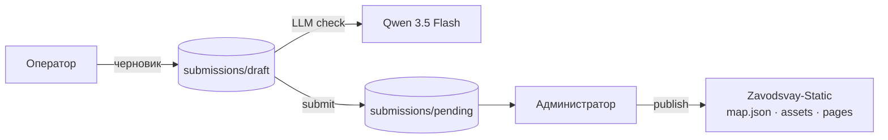

# MapControl

[](LICENSE)
[](CONTEXT.md)
[](CONTEXT.md)
[](https://nodejs.org/)
[](https://github.com/lovell/sharp)
[](CONTEXT.md)
[](CONTEXT.md)
[](https://yandex.ru/dev/maps/)
[](CONTEXT.md)
[](https://github.com/AlexanderKuzikov/Zavodsvay-Static)

**Локальный конструктор заявок на объекты карты** для сайта [zavodsvay.ru](https://zavodsvay.ru/).  
Оператор собирает данные и фото, **LLM** выравнивает текст, администратор модерирует, кадрирует изображения и публикует объект в пайплайн [Zavodsvay-Static](https://github.com/AlexanderKuzikov/Zavodsvay-Static).

> **Статус:** есть рабочий MVP операторского контура: форма, карта, черновик, загрузка фото, LLM-проверка текста и отправка заявки в pending.  
> Архитектурные детали, журнал решений и следующие этапы — в [**CONTEXT.md**](CONTEXT.md).

---

## Что уже работает

- Создание черновика заявки в `data/submissions/draft/{submissionId}`
- Редактирование заголовка, технического описания и координат
- Выбор точки на карте через **Яндекс.Карты v3** или ручной ввод координат
- Загрузка фото оператором, конвертация в **WebP** через `sharp`
- LLM-проверка текста через OpenAI-compatible API
- Принятие правок LLM или сохранение исходного текста оператора
- Отправка заявки в `data/submissions/pending/{submissionId}`
- Базовая серверная валидация и защита путей (`sanitizeId`, проверка path traversal)
- Исправленный UI-сценарий ошибки LLM: кнопка не зависает в состоянии «Проверяем…»

---

## Актуальное решение по LLM

После тестов подтвердилось, что **качество Qwen 3.5 Flash подходит**, а основная проблема была в провайдере и latency. Для `vsellm.ru` удалось отключить thinking через `chat_template_kwargs: { enable_thinking: false }`, но ответ занимал около 1.5 минуты, что неприемлемо для операторского сценария.

Текущий рабочий вариант — **RouterAI** с моделью `qwen/qwen3.5-flash-02-23`: ответ приходит примерно за 2 секунды, даёт полезные warnings, `confidence`, и корректные правки без лишнего reasoning-трафика.

Конфиг в `.env`:

```env
LLM_BASE_URL=https://routerai.ru/api/v1
LLM_API_KEY=xxxxxx
LLM_MODEL=qwen/qwen3.5-flash-02-23
```

В коде уже заложены:
- `temperature: 0.1`
- `max_tokens: 512`
- `response_format: { type: 'json_object' }`
- `chat_template_kwargs: { enable_thinking: false }`
- fallback-очистка `<think>...</think>` если провайдер всё же вернёт reasoning в тексте

---

## Как это работает



1. Оператор вводит заголовок, описание, координаты и добавляет фото.
2. Нажимает **«Проверить»** — LLM предлагает исправленный текст и warnings.
3. Оператор принимает правки или оставляет свой вариант.
4. После этого заявка попадает в `pending` и ждёт административной обработки.

---

## Технологии

| Область | Решение |
|---------|---------|
| **Runtime** | Node.js + Express |
| **Фронт** | Локальный browser UI без тяжёлого framework |
| **Карта** | [Яндекс.Карты JS API v3](https://yandex.ru/dev/maps/) |
| **Изображения** | `sharp`, конвертация в WebP |
| **LLM** | OpenAI-compatible API, текущий провайдер — RouterAI |
| **Модель** | `qwen/qwen3.5-flash-02-23` |
| **Хранение** | JSON + файловая структура `data/submissions/*` |
| **Интеграция** | Публикация в [Zavodsvay-Static](https://github.com/AlexanderKuzikov/Zavodsvay-Static) на следующем этапе |

---

## Структура репозитория

```text
MapControl/
├── CONTEXT.md
├── README.md
├── public/
│   └── app.js
├── src/
│   ├── prompts/
│   │   └── check-text.txt
│   └── server.js
├── data/
│   └── submissions/
│       ├── draft/
│       ├── pending/
│       └── archive/
└── .env.example
```

---

## Что ещё поправить

Ближайшие технические задачи:

- Нормализовать текст README/CONTEXT по факту реализованного MVP, а не по старому плану
- Зафиксировать LLM-решение: почему `vsellm` не подошёл, и почему выбран RouterAI
- Сделать админский контур: список pending-заявок, просмотр, категория, кадрирование, publish
- Добавить явный лог latency LLM на сервере, чтобы видеть деградацию провайдера сразу
- Подготовить экспорт в формат, совместимый с `Zavodsvay-Static`

---

## Связанные проекты

| Проект | Роль |
|--------|------|
| [**Zavodsvay-Static**](https://github.com/AlexanderKuzikov/Zavodsvay-Static) | Сайт завода «Гефест», источник боевых данных `data/map.json` |
| [**MapControl**](https://github.com/AlexanderKuzikov/MapControl) | Локальный контур ввода и модерации новых объектов |

---

## Лицензия

[Apache License 2.0](LICENSE)
