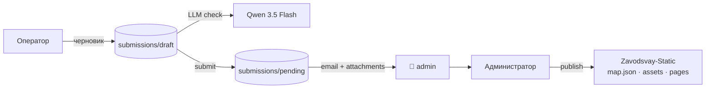

# MapControl

[](LICENSE)
[](CONTEXT.md)
[](CONTEXT.md)
[](https://nodejs.org/)
[](https://github.com/lovell/sharp)
[](CONTEXT.md)
[](CONTEXT.md)
[](https://yandex.ru/dev/maps/)
[](CONTEXT.md)
[](https://nodemailer.com/)
[](https://github.com/AlexanderKuzikov/Zavodsvay-Static)

**Локальный конструктор заявок на объекты карты** для сайта [zavodsvay.ru](https://zavodsvay.ru/).  
Оператор собирает данные и фото, **LLM** выравнивает текст и определяет категорию объекта, **заявка отправляется на email администратора** вместе с фото и JSON-дампом объекта, администратор модерирует, кадрирует изображения и публикует объект в пайплайн [Zavodsvay-Static](https://github.com/AlexanderKuzikov/Zavodsvay-Static).

> **Статус:** рабочий MVP операторского контура: форма, карта, черновик, загрузка фото, LLM-проверка текста с определением категории и количества свай, отправка заявки в pending + доставка на email через SMTP (Gmail / корпоративная почта zavodsvay.ru / Yandex / mail.ru).  
> Архитектурные детали, журнал решений и следующие этапы — в [**CONTEXT.md**](CONTEXT.md).

---

## Что уже работает

- Создание черновика заявки в `data/submissions/draft/{submissionId}`
- Редактирование заголовка, технического описания и координат
- Выбор точки на карте через **Яндекс.Карты v3** или ручной ввод координат
- Загрузка фото оператором, конвертация в **WebP** через `sharp`
- LLM-проверка текста через OpenAI-compatible API
- **LLM автоматически определяет категорию объекта** из 9 значений и **считает количество свай** из описания
- Принятие правок LLM или сохранение исходного текста оператора
- Поля `category` и `pileCount` редактируются оператором вручную после LLM-заполнения
- Отправка заявки в `data/submissions/pending/{submissionId}`
- **Email-уведомление при submit** — письмо с HTML-телом, сырым JSON объекта и прикреплёнными WebP-фото уходит на почту администратора через SMTP (`nodemailer` v8), настраивается под любой провайдер
- **Вложения только по meta.images** — фото в письме фильтруются по списку в meta, а не по содержимому папки (защита от накопившихся orphan-файлов)
- **GPS из EXIF фото** — координаты автоматически извлекаются из метаданных первого загруженного фото и заполняют поля широты/долготы
- **Вставка координат одной строкой** — поле широты принимает вставку вида «55.915, 57.870» и автоматически разбирает в оба поля
- Базовая серверная валидация и защита путей (`sanitizeId`, проверка path traversal)
- **Скрытый запуск** приложения через `start.vbs` + `launcher.js` — двойной клик на ярлыке, консоль не мелькает
- **Кнопка «Выход»** в шапке: диалог подтверждения → POST `/api/shutdown` → смена UI на «Сервер остановлен / Закрыть окно» (без зависания)
- **Скрипт создания ярлыков** `scripts/create-shortcuts.vbs` — генерирует `MapControl.lnk` и `Update MapControl.lnk` с правильными путями
- **Обновление через ярлык** `Update MapControl.lnk` → `update.vbs` → скрытый запуск `update.bat` (`git pull` + `npm ci`)

---

## Дизайн (Sky Pro)

- Дизайн-система **Sky Pro** с переключением светлой/тёмной темы
- **Локальные шрифты** Inter (woff2, без внешних CDN-зависимостей)

Ключевые принципы:

- **Бэджи над полями** вместо плавающих лейблов — поле и лейбл визуально склеены
- **Разделитель «результаты AI»** отделяет обязательный ввод оператора от сервисных полей
- **Split-кнопка** «Проверить / AI» — синяя основная часть + оранжевый AI-акцент
- **Синие кнопки** (`#0f2d8a`) — действия; **светло-синие бэджи** (`#5278d6`) — метки; **оранжевый** (`#e06c00`) — подтверждение / AI / ymaps-статус
- Все стили в `public/styles.css`, без CSS-фреймворков

---

## Актуальное решение по LLM

После тестов подтвердилось, что **качество Qwen 3.5 Flash подходит**, а основная проблема была в провайдере и latency. Для `vsellm.ru` удалось отключить thinking через `chat_template_kwargs: { enable_thinking: false }`, но ответ занимал около 1.5 минуты, что неприемлемо для операторского сценария.

Текущий рабочий вариант — **RouterAI** с моделью `qwen/qwen3.5-flash-02-23`: ответ приходит примерно за 2 секунды, даёт полезные warnings, `confidence`, корректные правки, категорию объекта и количество свай.

Конфиг в `.env`:

```env
LLM_BASE_URL=https://routerai.ru/api/v1
LLM_API_KEY=xxxxxx
LLM_MODEL=qwen/qwen3.5-flash-02-23
```

В коде уже заложены:
- `temperature: 0.1`
- `max_tokens: 512`
- `response_format: { type: 'json_object' }`
- `chat_template_kwargs: { enable_thinking: false }`
- fallback-очистка `<think>...</think>` если провайдер всё же вернёт reasoning в тексте

---

## LLM-контракт (ожидаемый JSON)

```json
{
  "title_suggested": "...",
  "techDescription_suggested": "...",
  "warnings": ["..."],
  "confidence": "high",
  "category_suggested": "house",
  "pileCount_suggested": 8
}
```

### Категории объектов

| Ключ | Название |
|------|----------|
| `house` | Жилой дом |
| `banya` | Баня |
| `fence` | Забор |
| `commercial` | Коммерция |
| `industrial` | Промышленные |
| `water` | Водные объекты |
| `social` | Социальные |
| `agro` | Сельхоз |
| `other` | Прочее |

- `category_suggested` — **обязательное поле**, модель выбирает всегда, по умолчанию `other`
- `pileCount_suggested` — **только если** количество свай явно указано в тексте (целое число > 0)

---

## Актуальное решение по Email

Для доставки заявок используется **nodemailer v8** с настраиваемым SMTP. Поддерживаются любые провайдеры:
- **Gmail** — `smtp.gmail.com:465` (SSL), требует App Password
- **Корпоративная почта zavodsvay.ru** — настройки уточняйте у системного администратора
- **Yandex 360** — `smtp.yandex.ru:465` (SSL)
- **biz.mail.ru** (VK WorkSpace) — `smtp.mail.ru:587` (STARTTLS), требует пароль приложения + 2FA

Письмо содержит:
- Человекочитаемый HTML-блок: объект, координаты, описание, категория, количество свай, оператор, дата
- Сырой JSON `meta` объекта в `<pre>` — для будущего машинного парсинга в админке
- WebP-фото как вложения

Конфиг в `.env` (пример для Gmail):

```env
SMTP_HOST=smtp.gmail.com
SMTP_PORT=465
SMTP_SECURE=true
SMTP_USER=your_email@gmail.com
SMTP_PASS=app_password
MAIL_FROM=Гефест Завод <your_email@gmail.com>
MAIL_TO=admin@example.com
# MAIL_NOTIFY=personal@example.com  # опционально: второй получатель
```

> **Следующий этап:** два получателя — `MAIL_TO` (очередь для админки) и `MAIL_NOTIFY` (личное уведомление).

---

## Как это работает



1. Оператор вводит заголовок, описание, координаты и добавляет фото.
2. Нажимает **«Проверить»** — LLM предлагает исправленный текст, warnings, категорию и количество свай.
3. Оператор принимает правки или оставляет свой вариант; при необходимости корректирует категорию или pileCount.
4. Нажимает **«Отправить»** — заявка сохраняется в `pending`, администратор получает письмо с JSON и фото.

---

## Установка на машину оператора

```bat
git clone https://github.com/AlexanderKuzikov/MapControl.git C:\Apps\MapControl
cd C:\Apps\MapControl
npm ci --omit=dev
copy .env.example .env
```

Открыть `.env` и заполнить все переменные. Затем создать ярлыки:

```
Двойной клик: scripts\create-shortcuts.vbs
→ создаёт MapControl.lnk и Update MapControl.lnk в папке scripts\
→ скопировать оба файла на Рабочий стол
```

> **Примечание:** API-ключ Яндекс.Карт должен быть выдан на `localhost`, а не `127.0.0.1`.

---

## Технологии

| Область | Решение |
|---------|---------|
| **Runtime** | Node.js + Express |
| **Запуск** | `start.vbs` → `launcher.js` (скрытый запуск, авто-порт, ожидание готовности) |
| **Фронт** | Локальный browser UI без тяжёлого framework, тема Sky Pro |
| **Карта** | [Яндекс.Карты JS API v3](https://yandex.ru/dev/maps/) |
| **Изображения** | `sharp`, конвертация в WebP, `exifr` для извлечения GPS-координат |
| **LLM** | OpenAI-compatible API, текущий провайдер — RouterAI |
| **Модель** | `qwen/qwen3.5-flash-02-23` |
| **Email** | `nodemailer` v8, SMTP через biz.mail.ru |
| **Хранение** | JSON + файловая структура `data/submissions/*` |
| **Интеграция** | Публикация в [Zavodsvay-Static](https://github.com/AlexanderKuzikov/Zavodsvay-Static) на следующем этапе |

---

## Структура репозитория

```text
MapControl/
├── CONTEXT.md
├── README.md
├── launcher.js          # Авто-порт, ожидание готовности сервера, открытие браузера
├── start.vbs            # Скрытый запуск launcher.js (без консоли)
├── update.bat           # git pull + npm ci, проверка что сервер закрыт
├── update.vbs           # Скрытый запуск update.bat
├── scripts/
│   └── create-shortcuts.vbs  # Генератор .lnk ярлыков для рабочего стола
├── public/
│   ├── app.js
│   ├── index.html
│   └── styles.css
├── src/
│   ├── prompts/
│   │   └── check-text.txt
│   └── server.js
├── data/
│   └── submissions/
│       ├── draft/
│       ├── pending/
│       └── archive/
└── .env.example
```

---

## Планы

- [ ] Два получателя email: `MAIL_TO` (очередь для машинного парсинга) + `MAIL_NOTIFY` (личное уведомление)
- [x] GPS-координаты из EXIF фото
- [x] Вставка координат одной строкой (широта + долгота)
- [x] Фильтр вложений письма по meta.images (защита от orphan-файлов)
- [x] Локальные шрифты Inter (без внешних CDN)
- [x] Переключение светлой/тёмной темы (localStorage)
- [ ] Вынести отправку письма в fire-and-forget / outbox, чтобы SMTP-сбой не ломал submit
- [ ] Админский контур: список pending-заявок, просмотр, кадрирование, publish
- [ ] Экспорт в формат, совместимый с `Zavodsvay-Static`
- [ ] Явный лог latency LLM на сервере для мониторинга деградации провайдера

---

## Связанные проекты

| Проект | Роль |
|--------|------|
| [**Zavodsvay-Static**](https://github.com/AlexanderKuzikov/Zavodsvay-Static) | Сайт завода «Гефест», источник боевых данных `data/map.json` |
| [**MapControl**](https://github.com/AlexanderKuzikov/MapControl) | Локальный контур ввода и модерации новых объектов |

---

## Лицензия

[Apache License 2.0](LICENSE)
