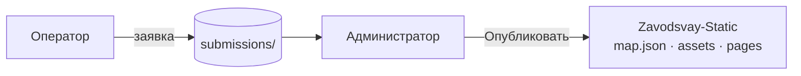

# MapControl

[](LICENSE)
[](CONTEXT.md)
[](CONTEXT.md)
[](https://nodejs.org/)
[](CONTEXT.md)
[](CONTEXT.md)
[](https://yandex.ru/dev/maps/)
[-8B5CF6)](CONTEXT.md)
[](https://github.com/AlexanderKuzikov/Zavodsvay-Static)

**Локальный конструктор заявок на объекты карты** для сайта [zavodsvay.ru](https://zavodsvay.ru/).  
Оператор собирает данные и фото, **LLM** помогает выровнять текст, администратор модерирует, кадрирует изображения и публикует объект в пайплайн [Zavodsvay-Static](https://github.com/AlexanderKuzikov/Zavodsvay-Static).

> **Статус:** проектирование и документация. Исходный код приложения — в разработке.  
> Подробные решения, макеты экранов и план этапов — в [**CONTEXT.md**](CONTEXT.md).

---

## Зачем нужен MapControl

На сайте «Гефест» более **500 объектов** на [карте выполненных работ](https://zavodsvay.ru/map/). Единый реестр — `data/map.json` в репозитории Zavodsvay-Static. Добавление через CLI (`tools/add-object.mjs`) удобно разработчикам, но **рискованно для неподготовленных пользователей**: координаты, категории, имена файлов, формат описаний.

**MapControl** разделяет ответственность:

| Роль | Задача |
|------|--------|
| **Оператор** | Вводит заголовок, описание, координаты и фото; проверяет текст через LLM; отправляет заявку |
| **Администратор** | Модерирует очередь, назначает категорию, кадрирует фото, публикует в `map.json` и связанные файлы сайта |

Оператор **не имеет доступа** к прод-данным. Администратор — **единый оркестратор** публикации.

---

## Основные возможности (план)

- **Пошаговый ввод** — заголовок, техническое описание, координаты (числа с валидацией или клик по карте)
- **Загрузка фото** — JPG/PNG/HEIC → **WebP без уменьшения разрешения** (для последующего кадрирования админом)
- **Проверка LLM** — кнопка «Проверить»: орфография, единый стиль, замечания без выдумывания цифр; оператор принимает правки по полям
- **Очередь заявок** — буфер `data/submissions/` до публикации (отдельно от `map.json`)
- **Режим администратора** — просмотр заявки, категория, кадрирование, превью карточки, публикация в Zavodsvay-Static
- **Согласованность с CLI** — та же бизнес-логика, что у `add-object.mjs` / `generate-pages.mjs` / `generate-sitemap.mjs`

---

## Как это работает



1. Оператор заполняет форму и нажимает **«Проверить»** → облачный LLM предлагает правки.
2. После подтверждения текста — **«Отправить администратору»**.
3. Администратор обрабатывает заявку (в т.ч. кадрирование) и **«Опубликовать на сайт»**.
4. Обновляются `data/map.json`, `assets/img/objects/{id}/`, страница объекта, `sitemap.xml`.
5. **Деплой сайта** выполняется отдельно (вне MapControl).

---

## Технологии

| Область | Решение |
|---------|---------|
| **Развёртывание** | Локальное приложение на ПК (без публичного сервера на старте) |
| **Карта** | [Яндекс.Карты JS API](https://yandex.ru/dev/maps/) (как на `/map/`) |
| **Изображения** | WebP; на этапе оператора — конвертация без даунскейла |
| **LLM** | Облачный API, по умолчанию **Qwen 3.5 Flash** (уже использовалась при подготовке 529+ объектов) |
| **Данные сайта** | JSON (`map.json`), координаты `[latitude, longitude]` |
| **Интеграция** | Публикация в клон/рабочую копию [Zavodsvay-Static](https://github.com/AlexanderKuzikov/Zavodsvay-Static) |
| **UI-стек** | *В выборе* (Electron / Tauri / PHP + браузер — см. [CONTEXT.md](CONTEXT.md)) |

---

## Категории объектов

При публикации администратор назначает одну из категорий:

`house` · `banya` · `fence` · `commercial` · `industrial` · `water` · `social` · `agro` · `other`

---

## Структура репозитория (целевая)

```
MapControl/
├── CONTEXT.md          # Решения, макеты экранов, этапы, журнал
├── README.md
├── data/
│   └── submissions/    # Заявки (pending / archive)
└── …                   # Исходники приложения (появятся по этапам)
```

---

## Связанные проекты

| Проект | Роль |
|--------|------|
| [**Zavodsvay-Static**](https://github.com/AlexanderKuzikov/Zavodsvay-Static) | Сайт завода «Гефест», SSOT объектов `data/map.json`, карта `/map/`, страницы `/objects/{id}/` |
| [**MapControl**](https://github.com/AlexanderKuzikov/MapControl) | Локальный приём и модерация **новых** объектов перед записью в Zavodsvay-Static |

---

## Документация

| Файл | Содержание |
|------|------------|
| [**CONTEXT.md**](CONTEXT.md) | Архитектура, роли, LLM-контракт, макеты O0–O5 / A0–A5, план реализации, открытые вопросы |
| **README.md** | Обзор для GitHub и новых участников |

---

## Этапы разработки

| Этап | Содержание | Статус |
|------|------------|--------|
| 0 | Репозиторий, README, CONTEXT | ✅ |
| 1 | Каркас приложения, режимы Оператор / Админ | ⬜ |
| 2 | Форма оператора, карта, WebP, черновики | ⬜ |
| 3 | LLM «Проверить», diff UI | ⬜ |
| 4 | Отправка заявок, список O0 | ⬜ |
| 5–7 | Очередь админа, кадрирование, публикация в сайт | ⬜ |

Полная таблица — в [CONTEXT.md § План реализации](CONTEXT.md#план-реализации-этапы).

---

## Требования (план)

- Windows 10+ (основная целевая ОС разработки)
- Доступ в интернет для LLM API и (опционально) загрузки API-карт
- Локальная копия **Zavodsvay-Static** с настроенным путём для публикации (этап администратора)
- API-ключ LLM в локальном конфиге (не коммитится; см. `.gitignore`)

---

## Безопасность

- Ключи API — только в `.env.local` / локальных настройках
- Оператор не редактирует `map.json` и не публикует на сайт
- LLM на этапе оператора получает **текст**, не фотографии (на старте)
- Заявки и прод-данные разделены до явного подтверждения администратором

---

## Лицензия

[Apache License 2.0](LICENSE)

---

## English summary

**MapControl** is a local desktop utility for submitting new map objects to the [zavodsvay.ru](https://zavodsvay.ru/) works map. Operators enter title, description, coordinates, and photos; an LLM (Qwen 3.5 Flash via API) suggests text improvements; an administrator moderates, crops images, assigns category, and publishes into the [Zavodsvay-Static](https://github.com/AlexanderKuzikov/Zavodsvay-Static) pipeline (`map.json`, assets, object pages, sitemap). The project is in early development — see [CONTEXT.md](CONTEXT.md) for architecture, screen wireframes, and roadmap.
